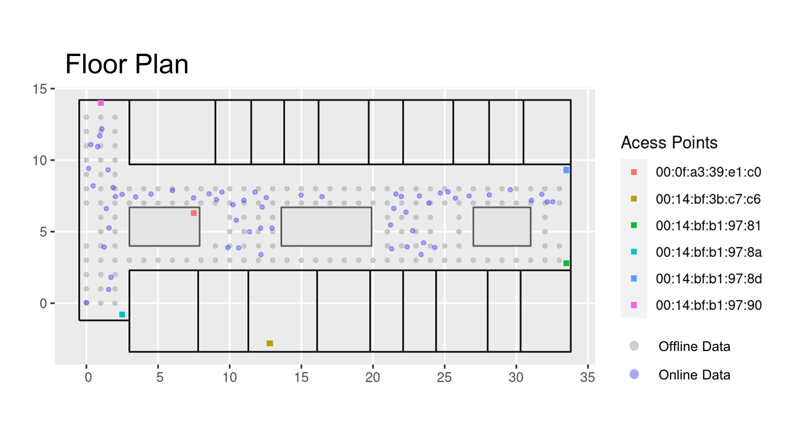

<h1 align="center"> Wi-Fi Indoor Positioning System (IPS) <br/> based on <br/> K-Nearest Neighbors (KNN) Algorithm </h1>
<b><p align="center">#WiFi fingerprinting  &emsp; #WiFi indoor positioning  &emsp; #K-nearest neighbor algorithm</p></b>

```
📦Indoor_positioning_system
 ┣ 📂clean_data  //After Data Tidying
 ┣ 📂img         //Visualizations
 ┣ 📂lib         //Supplementary Materials
 ┣ 📂raw_data    //Before Data Tidying
 ┣ 📄LICENSE
 ┣ 📄README.md
 ┣ 📄Step.1_Data_Cleaning.qmd
 ┣ 📄Step.1_Data_Cleaning.R
 ┣ 📄Step.2_Data_Analysis.qmd
 ┣ 📄Step.2_Data_Analysis.R
 ┣ 📄Step.3_Data_Visualization.qmd
 ┣ 📄Step.3_Data_Visualization.R
 ┗ 📄Step.Final_Complete_Code.R
```

<p align="right">
<a href="https://github.com/cyrus-pdx/Indoor_positioning_system/tree/SingSong" target="_blank">

</a>
</p>


<h2 align="center">Problem</h2>
<p align="center">
Identify the physical location of devices that are connected to the network.
<br>
<br>

</p>

</br>

<h2 align="center">Goals</h2>

- Create a model that takes a set of signal strengths of the relevant access points to a connected device.
- Predicts the physical location of that device. 
- Quantify the accuracy and precision of the model.

</br>

<h2 align="center">Results</h2>
<div align="center">
<table>
  <tr>
    <th>RSSI Heat Map of All APs and Angles</th>
    <th>RSSI Heat Map based on Fast Thin Plate Regression </th>
    <th>RSSI Heat Map based on Krigging Method</th>
  </tr>
  <tr>
    <td><p align="center"></p></td>
    <td><p align="center"></p></td>
    <td><p align="center"></p></td>
  </tr>
</table>
</div>

<div align="center">
<table>
  <tr>
    <th>k=1</th>
    <th>k=3</th>
    <th>k=5</th>
  </tr>
  <tr>
    <td><p align="center"></p></td>
    <td><p align="center"></p></td>
    <td><p align="center"></p></td>
  </tr>
</table>
</div>

<div align="center">
<table>
  <tr>
    <th>Average Error Distance</th>
    <th>Median Error Distance</th>
  </tr>
  <tr>
    <td><p align="center">2.517842 m</p></td>
    <td><p align="center">1.902775 m</p></td>
  </tr>
</table>
</div>
